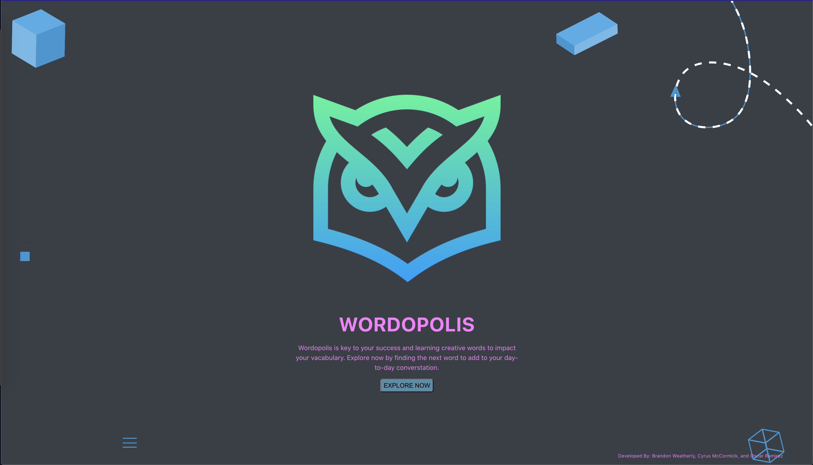
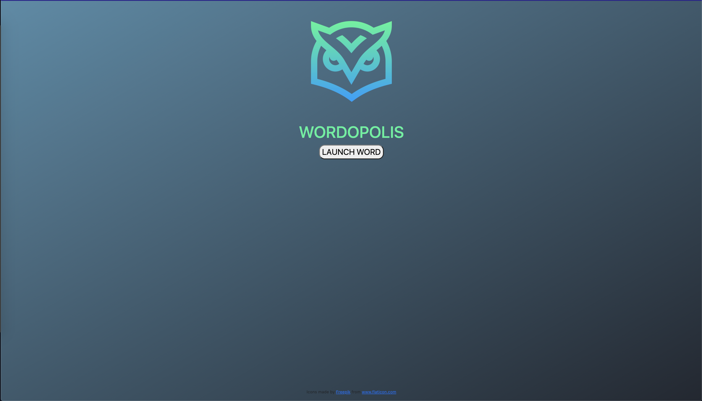
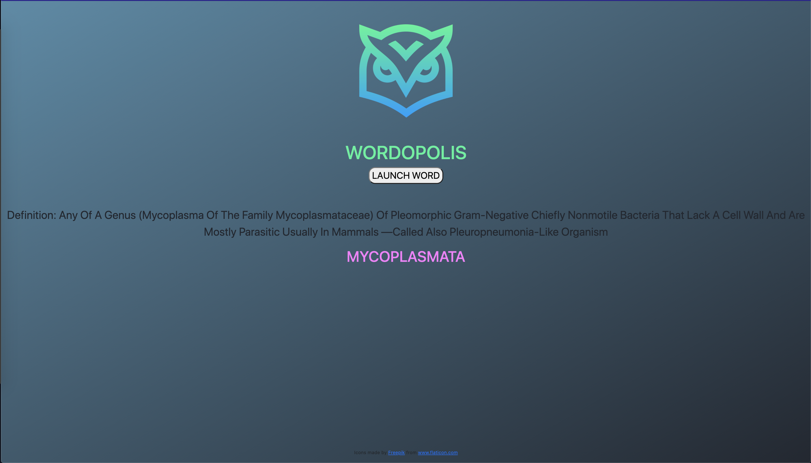

# Wordopolis

WEBSITE
Visit the Wordopolis website at [Project explanation](https://blissful-jones-7169c4.netlify.app/) for the most up to date words!

README
Wordopolis is an online tool used to pull random words and their corresponding definition to increase the end users vocabulary. 
The application was built using HTML, CSS/Bootstrap, JS and utilizing the Umbrella.JS library. 

REFERENCE
Icons made by: 
Icons made by <a href="https://www.freepik.com" title="Freepik">Freepik</a> from <a href="https://www.flaticon.com/" title="Flaticon">www.flaticon.com</a>

SCREENSHOTS: 

Team members: 
Brandon Weatherly
Cyrus Mccormick
Oscar Ramirez
